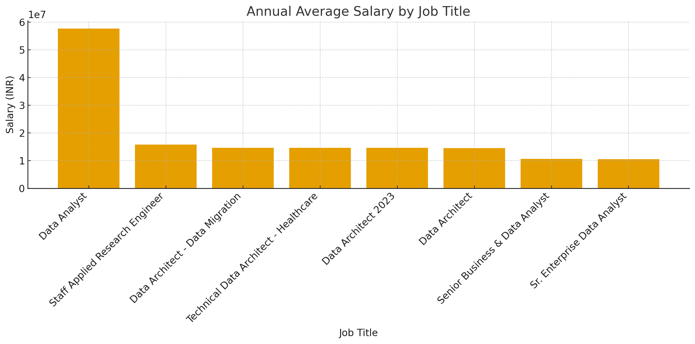
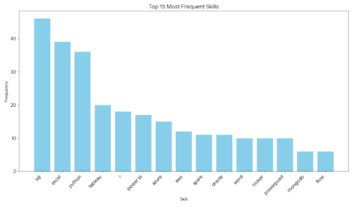

# Introduction
📊 Dive into the data job market! Focusing on data analyst roles, this project explores 💰 top-paying jobs, 🔥 in-demand skills, and 📈 where high demand meets high salary in data analytics.

🔍 SQL queries? Check them out here: [project_sql folder](/project_sql/)

# Background
Driven by a quest to navigate the data analyst job market more effectively, this project was born from a desire to pinpoint top-paid and in-demand skills, streamlining others work to find optimal jobs.

### The questions I wanted to answer through my SQL queries were:

1. What are the top-paying data analyst jobs?
2. What skills are required for these top-paying jobs?
3. What skills are most in demand for data analysts?
4. Which skills are associated with higher salaries?
5. What are the most optimal skills to learn?

# Tools I Used
For my deep dive into the data analyst job market, I harnessed the power of several key tools:

- **SQL:** The backbone of my analysis, allowing me to query the database and unearth critical insights.
- **PostgreSQL:** The chosen database management system, ideal for handling the job posting data.
- **Visual Studio Code:** My go-to for database management and executing SQL queries.
- **Git & GitHub:** Essential for version control and sharing my SQL scripts and analysis, ensuring collaboration and project tracking.

# The Analysis
Each query for this project aimed at investigating specific aspects of the data analyst job market. Here’s how I approached each question:

### 1. Top Paying Data Analyst Jobs
To identify the highest-paying roles, I filtered data analyst positions by average yearly salary and location, focusing on jobs in India. This query highlights the high paying opportunities in the field.

```sql
SELECT
    job_id,
    job_title AS "Title",
  --job_title_short,
    job_location AS "Location",
    job_via AS "Via",
    job_schedule_type AS "Employment Type",
    job_posted_date::DATE AS "Posted Date",
    -- salary_year_avg,
    -- salary_year_avg * 83 AS salary_year_avg_in_rupees
    to_char(salary_year_avg * 88.69, '99,99,99,999') AS annual_average_salary
-- Converting the annual salary from USD to INR (₹) for India-based roles
-- and formatting the result using the Indian numbering system for readability.
FROM
    job_postings_fact
WHERE
    job_title_short = 'Data Analyst' AND
    salary_year_avg IS NOT NULL AND
    job_country = 'India'
ORDER BY
    annual_average_salary DESC
LIMIT 10;
```

Here's the breakdown of the top data analyst jobs in 2023:
- **Wide Salary Range:** Top 10 paying data analyst roles span from ₹98,60,111 to ₹5,76,48,500 indicating significant salary potential in the field.
- **Diverse Employers:** Companies like SmartAsset, Meta, and AT&T are among those offering high salaries, showing a broad interest across different industries.
- **Job Title Variety:** There's a high diversity in job titles, from Data Analyst to Sr. Enterprise Data Analyst reflecting varied roles and specializations within data analytics.


*Bar graph visualizing the salary for the top 10 salaries for data analysts; ChatGPT generated this graph from my SQL query results*

### 2. Skills for Top Paying Jobs
To understand what skills are required for the top-paying jobs, I joined the job postings with the skills data, providing insights into what employers value for high-compensation roles.
```sql

WITH top_paying_jobs AS 
(
    SELECT 
        job_id,
        job_title AS "Title",
        --job_title_short,
        job_location AS "Location",
        job_via AS "Via",
        job_schedule_type AS "Employment Type",
        job_posted_date::DATE AS "Posted Date",
        -- salary_year_avg,
        -- salary_year_avg * 83 AS salary_year_avg_in_rupees
        to_char(salary_year_avg * 88.69, '99,99,99,999') AS annual_average_salary
        -- Converting the annual salary from USD to INR (₹) for India-based roles
        -- and formatting the result using the Indian numbering system for readability.
    FROM
        job_postings_fact
    WHERE
        job_title_short = 'Data Analyst' AND
        salary_year_avg IS NOT NULL AND
        job_country = 'India'

)

SELECT 
    skills_dim.Skills,
    top_paying_jobs."Title",
    annual_average_salary,
    top_paying_jobs."Location",
    top_paying_jobs."Posted Date"   
FROM
    top_paying_jobs
INNER JOIN 
    skills_job_dim
ON 
    top_paying_jobs.job_id = skills_job_dim.job_id
INNER JOIN  
    skills_dim
ON 
    skills_job_dim.skill_id = skills_dim.skill_id
ORDER BY 
    annual_average_salary  DESC
LIMIT 10;
```
Here's the breakdown of the most demanded skills for the top 10 highest paying data analyst jobs in 2023:
- **SQL** is leading with a bold count of 46.
- **excel** follows closely with a bold count of 39.
- **python** is also highly sought after, with a bold count of 36.
Other skills like **tableau**, **power bi**, **looker**, and **aws** show varying degrees of demand.


*Bar graph visualizing the count of skills for the top 10 paying jobs for data analysts; ChatGPT generated this graph from my SQL query results*

### 3. In-Demand Skills for Data Analysts

This query helped identify the skills most frequently requested in job postings, directing focus to areas with high demand.

```sql
WITH remote_job_skills AS
(
    SELECT
        skill_id,
        COUNT(*) AS demand_count
    FROM
        skills_job_dim
    INNER JOIN 
        job_postings_fact
    ON 
        job_postings_fact.job_id = skills_job_dim.job_id
    WHERE
        job_postings_fact.job_title_short = 'Data Analyst' AND 
        job_country = 'India'
    GROUP BY
        skill_id
)

SELECT
    skills_dim.skills,
    demand_count
FROM 
    remote_job_skills
INNER JOIN 
    skills_dim
ON 
    skills_dim.skill_id = remote_job_skills.skill_id
ORDER BY demand_count DESC
LIMIT 5;
```
Here's the breakdown of the most demanded skills for data analysts in 2023
- **SQL** and **Python** remain fundamental, emphasizing the need for strong foundational skills in data processing and spreadsheet manipulation.
- **Programming** and **Visualization Tools** like **Excel**, **Tableau**, and **Power BI** are essential, pointing towards the increasing importance of technical skills in data storytelling and decision support.


| Skills   | Demand Count |
|----------|--------------|
| SQL      | 3167         |
| Python   | 2207         |
| Excel    | 2118         |
| Tableau  | 1673         |
| Power BI | 1285         |

*Table of the demand for the top 5 skills in data analyst job postings*

### 4. Skills Based on Salary
Exploring the average salaries associated with different skills revealed which skills are the highest paying.
```sql
SELECT
    skills,
    ROUND(AVG(salary_year_avg),0) AS average_salary
FROM 
    job_postings_fact
INNER JOIN 
    skills_job_dim ON job_postings_fact.job_id = skills_job_dim.job_id
INNER JOIN 
    skills_dim ON skills_job_dim.skill_id = skills_dim.skill_id
WHERE
    job_title_short = 'Data Analyst' AND
    salary_year_avg IS NOT NULL 
    AND job_country = 'India'
GROUP BY
    skills
ORDER BY
    average_salary DESC
LIMIT 10;
```
Here's a breakdown of the results for top paying skills for Data Analysts:

- **High Value on Data Engineering Foundations:** Skills like PostgreSQL, MySQL, Linux, and MongoDB dominate the top salary range, showing that companies pay a premium for strong data infrastructure and database management expertise—core to any analytics or engineering workflow.
- **Rising Demand for Scalable Big Data Processing:** Tools such as PySpark and Airflow indicate that organizations are prioritizing large-scale data processing and automated pipelines. This reflects a shift toward complex, production-level analytics environments rather than basic reporting.
- **Cloud & Advanced Analytics Ecosystem Pays More:** High salaries associated with Databricks and Neo4j highlight the value of modern cloud data platforms and graph databases. These skills enable more advanced problem-solving—like graph analytics, machine learning workflows, and distributed computing.
- **Security & Compliance Knowledge Boosts Compensation:** The appearance of GDPR among top-paying skills indicates that regulatory and compliance expertise is becoming a differentiator, especially for companies handling sensitive or large-scale customer data.

| Skills      | Average Salary (₹) |
|-------------|---------------------|
| PostgreSQL  | 1,65,000            |
| GitLab      | 1,65,000            |
| PySpark     | 1,65,000            |
| MySQL       | 1,65,000            |
| Linux       | 1,65,000            |
| Neo4j       | 1,63,782            |
| GDPR        | 1,63,782            |
| Airflow     | 1,38,088            |
| MongoDB     | 1,35,994            |
| Databricks  | 1,35,994            |

*Table of the average salary for the top 10 paying skills for data analysts*

### 5. Most Optimal Skills to Learn

Combining insights from demand and salary data, this query aimed to pinpoint skills that are both in high demand and have high salaries, offering a strategic focus for skill development.

```sql
WITH skill_demand AS (
    SELECT
        skills_dim.skill_id AS skill_id,
        skills_dim.skills,
        COUNT(skills_job_dim.skill_id) AS demand_count
    FROM 
        job_postings_fact
    INNER JOIN 
        skills_job_dim
    ON 
        job_postings_fact.job_id = skills_job_dim.job_id
    INNER JOIN 
        skills_dim
    ON 
        skills_dim.skill_id = skills_job_dim.skill_id
    WHERE
        job_title_short = 'Data Analyst' AND
        salary_year_avg IS NOT NULL AND
        job_country = 'India'
    GROUP BY
        skills_dim.skill_id
), average_salary_skill AS (
    SELECT
        skills_dim.skill_id as skill_id,
        skills,
        ROUND(AVG(salary_year_avg),0) AS average_salary
    FROM 
        job_postings_fact
    INNER JOIN 
        skills_job_dim ON job_postings_fact.job_id = skills_job_dim.job_id
    INNER JOIN 
        skills_dim ON skills_job_dim.skill_id = skills_dim.skill_id
    WHERE
        job_title_short = 'Data Analyst' AND
        salary_year_avg IS NOT NULL 
        AND job_country = 'India'
    GROUP BY
        skills_dim.skill_id
)
SELECT 
    skill_demand.skill_id,
    skill_demand.skills,
    demand_count,
    average_salary 
FROM 
    skill_demand
INNER JOIN 
    average_salary_skill 
ON skill_demand.skill_id = average_salary_skill.skill_id
WHERE demand_count > 10 
ORDER BY
    average_salary DESC
```

| Skill ID | Skills   | Demand Count | Average Salary ($) |
|----------|-----------|--------------|-------------------:|
| 92       | spark     | 11           |            118,332 |
| 183      | power bi  | 17           |            109,832 |
| 79       | oracle    | 11           |            104,260 |
| 74       | azure     | 15           |             98,570 |
| 1        | python    | 36           |             95,933 |
| 76       | aws       | 12           |             95,333 |
| 182      | tableau   | 20           |             95,103 |
| 0        | sql       | 46           |             92,984 |
| 181      | excel     | 39           |             88,519 |
| 5        | r         | 18           |             86,609 |

*Table of the most optimal skills for data analyst sorted by salary*

Here's a breakdown of the most optimal skills for Data Analysts in 2023: 
- **Advanced Data Processing Commands Premium Salaries:**
Spark stands out with the highest average salary at $118,332, despite having moderate demand (11 postings). This indicates that advanced data processing and distributed computing skills are scarce yet highly valued—ideal for analysts aiming to transition into big data roles.
- **Business Intelligence Tools Provide Strong Earning Potential:**
Power BI and Tableau show solid demand (17 and 20 respectively) combined with strong salaries above $95K, underscoring the growing reliance on dashboarding, reporting, and business-focused data storytelling. Organizations heavily depend on these tools to drive insights for decision-making.
- *Cloud Technologies Remain Highly Relevant:*
Skills such as Azure and AWS continue to demonstrate strong demand (15 and 12), with competitive salaries around $98K–$95K. This reflects the fast-growing shift toward cloud-based data infrastructure and analytics pipelines.
- **Traditional Database Expertise Still Essential:**
SQL, Oracle, and Excel remain foundational skills with high demand—SQL alone appearing in 46 postings. While their salaries are slightly lower (ranging from $88K–$104K), they continue to form the backbone of daily data analysis, ETL processes, and reporting.
- **Programming Languages Offer Balanced Demand & Salary:**
Python and R maintain strong demand (36 and 18) with competitive salaries around $95K and $86K. These remain essential for analysts working in data cleaning, statistical modeling, automation, and basic machine learning.

# What I Learned

Throughout this adventure, I've turbocharged my SQL toolkit with some serious firepower:

- **🧩 Complex Query Crafting:** Mastered the art of advanced SQL, merging tables like a pro and wielding WITH clauses for ninja-level temp table maneuvers.
- **📊 Data Aggregation:** Got cozy with GROUP BY and turned aggregate functions like COUNT() and AVG() into my data-summarizing sidekicks.
- **💡 Analytical Wizardry:** Leveled up my real-world puzzle-solving skills, turning questions into actionable, insightful SQL queries.

# Conclusions

### Insights
From the analysis, several general insights emerged:

1. **Top-Paying Data Analyst Jobs**: The highest-paying jobs for data analysts that in India offer a wide range of salaries, the highest at ₹5,76,48,500
2. **Skills for Top-Paying Jobs**: High-paying data analyst jobs require advanced proficiency in SQL, suggesting it’s a critical skill for earning a top salary.
3. **Most In-Demand Skills**: SQL is also the most demanded skill in the data analyst job market, thus making it essential for job seekers from India.
4. **Skills with Higher Salaries**: Specialized skills, such as postgresql and gitlab, are associated with the highest average salaries, indicating a premium on niche expertise.
5. **Optimal Skills for Job Market Value**: SQL leads in demand and offers for a high average salary, positioning it as one of the most optimal skills for data analysts to learn to maximize their market value.Although skills like spark pays more but they are less in demand than SQL.

### Closing Thoughts

This project enhanced my SQL skills and provided valuable insights into the data analyst job market. The findings from the analysis serve as a guide to prioritizing skill development and job search efforts. Aspiring data analysts can better position themselves in a competitive job market by focusing on high-demand, high-salary skills. This exploration highlights the importance of continuous learning and adaptation to emerging trends in the field of data analytics.